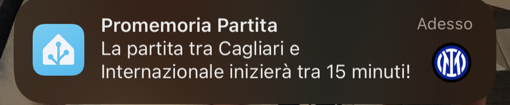

# Calcio Live - Home Assistant Integration

## Supportami  
Se ti piace il mio lavoro e vuoi che continui nello sviluppo delle card, puoi offrirmi un caffè.

[](https://www.paypal.com/donate/?hosted_button_id=Z6KY9V6BBZ4BN)

Non dimenticare di seguirmi sui social:

[](https://www.tiktok.com/@silviosmartalexa)

[](https://www.instagram.com/silviosmartalexa)

[](https://www.youtube.com/@silviosmartalexa)


## Video Guida

[Guarda il video su YouTube](https://www.youtube.com/watch?v=K-FAJmwsGXs)


## Descrizione
L'integrazione "Calcio Live" per Home Assistant permette di ottenere informazioni in tempo reale sulle competizioni di calcio, come classifiche, cannonieri e giornate di campionato.
    


## Installazione manuale tramite HACS

1. Aggiungi il repository `https://github.com/Bobsilvio/calcio-live` in HACS come INTEGRAZIONE.
    


2. Cerca "Calcio Live" in HACS e installa l'integrazione.
    


4. Vai su Impostazioni > Integrazione > Aggiungi Integrazione e cerca 'Calcio-Live' 


5. Configura l'integrazione tramite l'interfaccia di Home Assistant.


### NOTA: !!!! NON DIMENTICARE IL PUNTO 7 - LE CARD VANNO INSTALLATE A PARTE COME PUNTO 1 e 2!!!!


6. Scegli il campionato da seguire o della tua squadra, è molto intuitivo i nomi sono assegnati automaticamente e la squadra la devi scegliere in base al campionato, ma non ti preoccupare, se non la trovi puoi inserire in fondo ad ogni campionato un id personale o all'inizio della configurazione.
Nella versione v2.1.1 è stata introdotta la data, quindi puoi scegliere da che data a che data vedere le partite, puoi selezionare anche tutto il campionato inserendo 1 anno intero.

    
    
    
    


   


### 7. Per la card, vai su: https://github.com/Bobsilvio/calcio-live-card e segui le istruzioni


## Note
   Puoi seguire più campionati o più squadre
   
## Automazioni
### Notifica 15 minuti prima dell'inizio della partita


Notifica l'inizio della partita 15 minuti prima usando il sensore `sensor.calciolive_next...`.  
**Nota**: Cambia anche `notify.mobile_app_xxx` con il tuo dispositivo.

```yaml
alias: CalcioLive - Notifica 15 minuti prima della partita Inter
description: Invia una notifica al cellulare 15 minuti prima dell'inizio della partita.
trigger:
  - platform: template
    value_template: >
      {{
      (as_timestamp(strptime(state_attr('sensor.calciolive_next_ita_1_internazionale',
      'matches')[0].date, '%d/%m/%Y %H:%M')) - 900) | timestamp_custom('%Y-%m-%d
      %H:%M') == now().strftime('%Y-%m-%d %H:%M') }}
condition:
  - condition: template
    value_template: >
      {{ state_attr('sensor.calciolive_next_ita_1_internazionale',
      'matches')[0].state == 'pre' }}
action:
  - service: notify.mobile_app_xxx
    data:
      title: CalcioLive - Promemoria Partita
      message: >
        La partita tra {{
        state_attr('sensor.calciolive_next_ita_1_internazionale',
        'matches')[0].home_team }} e {{
        state_attr('sensor.calciolive_next_ita_1_internazionale',
        'matches')[0].away_team }} inizierà tra 15 minuti!
      data:
        image: >
          {{ state_attr('sensor.calciolive_next_ita_1_internazionale', 'team_logo') }}
mode: single
```
---

Notifica Goal con dettagli su minuti e giocatore usando il sensore `sensor.calciolive_next...`.  
**Nota**: Cambia anche `notify.mobile_app_xxx` con il tuo dispositivo.


```yaml
alias: CalcioLive - Notifica Goal Internazionale con Minuti e Giocatore
description: Invia una notifica per ogni gol segnato, inclusi i rigori.
triggers:
  - value_template: >
      
        
          true
        
      
    trigger: template
conditions: []
actions:
  - variables:
      match_details: >-
        {{ state_attr('sensor.calciolive_next_ita_1_internazionale',
        'matches')[0].match_details }}
  - repeat:
      for_each: "{{ match_details }}"
      sequence:
        - variables:
            event: "{{ repeat.item }}"
        - choose:
            - conditions:
                - condition: template
                  value_template: |
                    {{ 'Goal' in event or 'Penalty' in event }}
              sequence:
                - data_template:
                    title: >
                      Partita {{
                      state_attr('sensor.calciolive_next_ita_1_internazionale',
                      'matches')[0].home_team }} vs {{
                      state_attr('sensor.calciolive_next_ita_1_internazionale',
                      'matches')[0].away_team }}
                    message: >
                         ⚽ {{ tipo }}
                      {{ giocatore }} al minuto {{ minuto }}!
                  action: notify.mobile_app_silvio_iphone
mode: queued
```

## Informazioni
Questa è la mia prima card e sicuramente c'è tanto lavoro da fare, se vi piace, potete ricambiare seguendomi nei social:

TikTok: @silviosmartalexa
