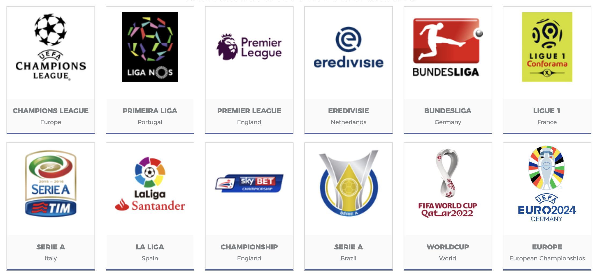
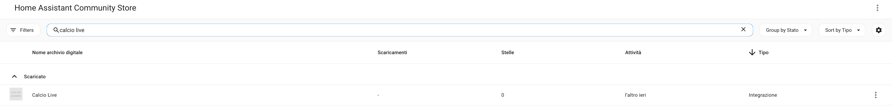
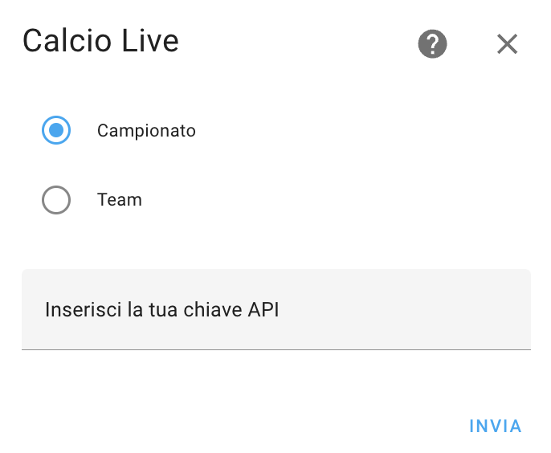
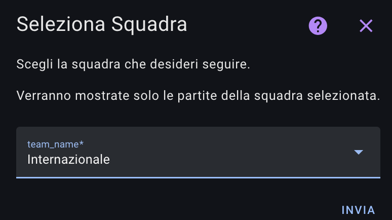
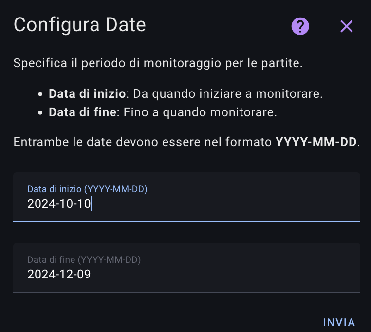

# Calcio Live - Home Assistant Integration

## Descrizione
L'integrazione "Calcio Live" per Home Assistant permette di ottenere informazioni in tempo reale sulle competizioni di calcio, come classifiche, cannonieri e giornate di campionato.
Questi sono i campionati supportati GRATUITAMENTE da football-data.org, ma a pagamento c'è ne sono altre.
    

## Installazione manuale tramite HACS

1. Aggiungi il repository `https://github.com/Bobsilvio/calcio-live` in HACS come INTEGRAZIONE.
    
    
2. Cerca "Calcio Live" in HACS e installa l'integrazione.
    

3. Devi avere un codice API e per ottenerlo vai su: https://www.football-data.org/client/register
   registrati (email - passoword - scegli 'i wanna remain unarmed') e ottieni la tua chiave API che arriva sull'e-mail

3. Vai su Impostazioni > Integrazione > Aggiungi Integrazione e cerca 'Calcio-Live' 

4. Configura l'integrazione tramite l'interfaccia di Home Assistant.

5. Inserisci API Key nella prima riga
   Scegli il campionato da seguire
   Scegli nome che avra il sensore (se scrivi serie a, il sensore sarà sensor.calciolive_seriea_xxx)

    
    
    
    
   
7. Per la card, vai su: https://github.com/Bobsilvio/calcio-live-card e segui le istruzioni

## Squadra del cuore
Puoi anche seguire la tua squadra del cuore con tutte le partite passate e future
   Andate sul sito https://www.football-data.org/coverage
   Selezionate il campionato e poi click sulla vostra squadra, in alto compare un numero, è il vostro team_id

   Ricordatevi se scegliete il Team ID di crearlo come nuovo sensore e di NON selezionare il campionato.
   
## Note
Puoi usare la stessa api key per piu campionati, ricordati di dare un nome al campionato

## Utilizzo dei sensori
Vengono creati 5 sensori:

 Questo sensore viene è la lista dei campionati e delle giornate in corso
- sensor.calciolive_competizioni

 Questo sensore ci da la classifica dei capocannonieri del campionato
- sensor.calciolive_nomescelto_cannonieri

 Questo sensore ci da la classifica del campionato
- sensor.sensor.calciolive_nomescelto_classifica

 Questo sensore ci da le sfide della giornata in corso o future (nel caso siano finite tutte le partite)
- sensor.calciolive_nomescelto_match_day

 Questo sensore viene creato solo se inserisci il team_id 
- sensor.calciolive_nomescelto

## Informazioni
Questa è la mia prima card e sicuramente c'è tanto lavoro da fare, se vi piace, potete ricambiare seguendomi nei social:

TikTok: @silviosmartalexa
